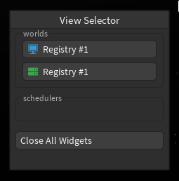
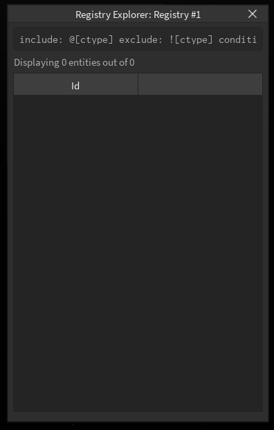
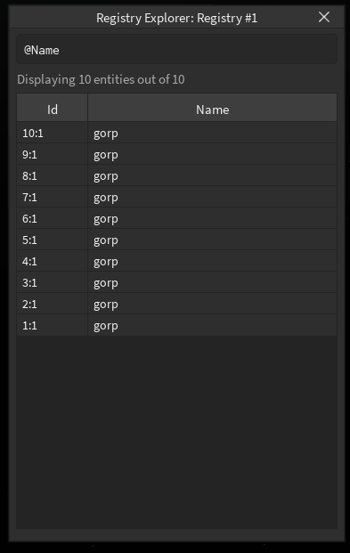
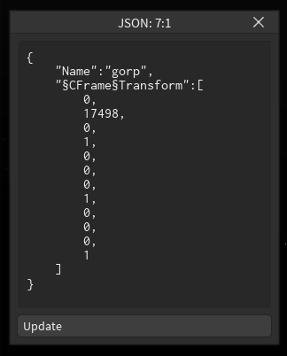

# Crash Course

gorp is a debugging / profiler library for ecr on Roblox that is hacked together.

## Setting Up

1. Require gorp on both the server and client
2. If you are using `roblox-ts`, run `gorp.set_ecr(ecr)`
3. Run `gorp.compat_set_cts(components: {[string]: ctype})` with all the components in-game and their names.
4. Add a world using `gorp.add_world(world: ecr.Registry, name: string)`
5. On the client, spawn the registry selector widget through `gorp.spawn_widget("registry_selector")`
6. Enable the UI on the client with `gorp.enabled(true)`

And you're done! You've setup the bare minimum to make gorp useful.

## Showcase

You should see something like this on the client when you run your game.

When you press any of the buttons, you'll see the next widget open up:

Here, you can see all the entities inside the current registry.
If you opened it on the server, you should see no entities.
This is currently a limitation of gorp and will be addressed in a later update.

### Querying

You can add a query through the top using the text input.
You can include all entities with a given component using `@Component`, like `@Transform`.
You can exclude all entities with a given component using `!Component`, like `!Enemy`
You can match all entities that have a given component set to given value using `Component=Value`, like `Name="hello!"`
You can exclude all entities that have a given component set to given using `!Component=Value`, like `!Name="Enemy"`
gorp currently supports the following primitives:

-   `string`: Surround text with `""` or `''`
-   `number`: Any decimal number
-   `boolean`: `true` and `false`
    gorp also has special functions to create certain datatypes:
-   `Vector3`: `Vector3(0, 0, 0)`
-   `Vector2`: `Vector2(0, 0)`
-   `Color3`: `Color3(137, 10, 20)`
-   `CFrame`: `CFrame(0, 3, 0)`
-   `CFrame`: `CFrame(Vector3(0, 1, 0), Vector3(7, 0, 0))`
-   `CFrame`: `CFrame(0, 5, 1, 2, 3, 7)`

By providing a query, gorp will display all the given components.

### Editing

You can click on any component to modify the value. You can click on the Id to modify all the components.
Use the `§` symbol to mark a type and end it: `§CFrame§Transform`. Everything is formatted with JSON

