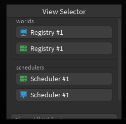
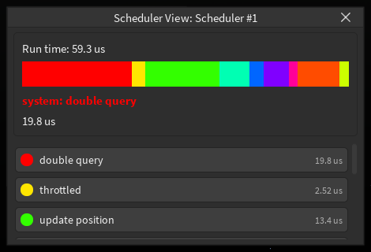
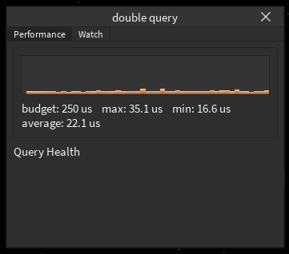
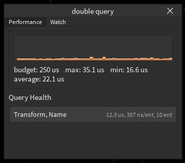

# Scheduler

The scheduler displays some UI giving basic profiler stats about your systems.

## Setting Up

1. Create a new scheduler using `gorp.scheduler.new(name: string)`
2. In your main update loop, run each system using `scheduler:system(name: string, system: (...) -> (), ...)`. This will call the system for you.
3. After you have finished your update loop, run `scheduler:finish()`

And that's... all that has to be done for the scheduler.
You should see something like this when you start gorp.

## Showcase

When you click on any of the scheduler buttons, you should see this widget open:

This gives you a basic run down on how long each system takes and how long it takes in total.
You can hover over the colored bars to view which system takes that much time.

When you click on any of the systems, you should see something like this open up:

This will give you more details about how the system runs, like the max, min and average runtime.

## Getting query data

There is clearly a unused field here, `Query Health`.
This is because gorp is unable to do anything, since the registry is frozen.
When a table is frozen, you are unable to modify it. This is for for example, immutable objects.
BUT gorp needs to modify the registry in order to interact with it. So how do you unfreeze it?
It's simple really, just clone the table! You can use `table.clone` to clone the table and get a unfrozen registry.
This will definitely not cause any bugs in your code. Just make sure that everyone is using the same unfrozen registry.

If done correctly, gorp will show details about queries and how they perform!

You can view how long the query took, how long it took to get the next entity and how many entities are inside the query.
This allows you to optimize the query to reduce the time it takes, by for example grouping it.
